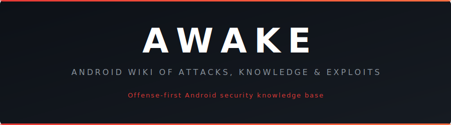

<div align="center">

<picture>
  <source media="(prefers-color-scheme: dark)" srcset="assets/banner-dark.svg">
  <source media="(prefers-color-scheme: light)" srcset="assets/banner-light.svg">
  
</picture>

<br><br>

[](https://zahidaz.github.io/awake/)&nbsp;
[](LICENSE)&nbsp;
[](https://github.com/zahidaz/awake/commits/main)&nbsp;
[](https://github.com/zahidaz/awake/stargazers)

<br>

**A structured, cross-referenced knowledge base for Android security research.**
<br>
**How malware works. How attacks exploit the platform. How protections are broken.**

<br>

[](#malware-families)&nbsp;
[](#attack-techniques)&nbsp;
[](#reversing)&nbsp;
[](#packers--protectors)&nbsp;
[](#permissions)&nbsp;
[](#grayware)

</div>

---

## Why AWAKE

Android security knowledge is scattered across vendor blog posts, conference talks, academic papers, and dead links. Understanding a single malware family means reading five different reports from five different vendors, each using different names for the same thing.

AWAKE puts it in one place with cross-references that individual writeups cannot provide. Technique pages link to families that use them. Families link to packers that protect them. Packers link to reversing workflows that break them.

> [!IMPORTANT]
> This is not a compliance checklist or a defense guide. AWAKE documents how things work and how they break. Offense-first.

---

## What's Inside

### Attack Techniques

Techniques organized by attack surface: overlays, accessibility abuse, automated fraud, NFC relay, supply chain attacks, and more. Kill chain showing how techniques combine in real operations. Technique combination matrix showing the most common pairings across active malware families.

### Malware Families

Individual family write-ups covering capabilities, C2 infrastructure, campaign history, and code lineage. Timeline from 2010 to present. Naming conventions for mapping between vendor detection names. Threat actor profiles with MaaS pricing and attribution.

### Packers & Protectors

Every major Android packer documented: identification, protection mechanisms, and unpacking methodology. Head-to-head comparison matrix across all documented protectors. Decision tree for approaching unknown samples. Universal unpacking toolkit.

### Permissions

Android permissions documented from an abuse perspective. What each permission unlocks, how malware uses it, and escalation patterns showing how malware moves from auto-granted normal permissions to full device control.

### Reversing

Static analysis, dynamic analysis, hooking, patching, and network interception. Development framework pages covering Flutter, React Native, Unity, .NET MAUI, and more, each with framework-specific architecture, analysis workflow, and hooking strategy.

### Grayware

The gray area between legitimate software and malware. Data broker SDKs, ad fraud, stalkerware, predatory lending apps, firmware grayware, commercial surveillance, and the data trade ecosystem that funds it all.

### Platform Security

Android's security mechanisms from the offense side. App sandbox, SELinux, verified boot, keystore, Play Integrity, and biometric authentication: what they protect and where they fall short.

---

<div align="center">

### Browse the full wiki

**[https://zahidaz.github.io/awake/](https://zahidaz.github.io/awake/)**

</div>

---

## Local Development

```bash
uv pip install -e .
mkdocs serve
```

## Contributing

Contributions welcome: malware analysis, attack techniques, packer analysis, reversing methodology, corrections.

All contributions must be technically accurate and verifiable. No active exploit code for unpatched vulnerabilities.

## License

MIT License. See [LICENSE](LICENSE) for details.
