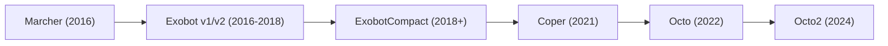

# Exobot

Major MaaS banking trojan that operated from 2016 to 2018, when its author put the source code up for sale. Based on the [Marcher](marcher.md) trojan, Exobot was one of the most commercially successful Android banking trojans of its era. Its source code leak in May 2018 spawned the ExobotCompact/Coper lineage that eventually became [Octo](octo.md), one of the most active banking trojans of 2022-2025.

## Overview

| Property | Value |
|----------|-------|
| **First Seen** | Late 2016 |
| **Last Seen / Status** | Author quit January 2018; source leaked May 2018; lives on through [Octo](octo.md) lineage |
| **Type** | Banking trojan / MaaS |
| **Attribution** | Unknown author; ExobotCompact by actor "android" |
| **Aliases** | Trojan-Banker.AndroidOS.Marcher (Kaspersky), Marcher (some vendors) |

## Distribution

Sold as MaaS on underground forums. Distributed to victims via Google Play dropper apps, phishing SMS campaigns, and third-party app stores. Campaigns targeted Turkey, France, Germany, Australia, Thailand, and Japan.

## Capabilities

| Capability | Implementation |
|------------|----------------|
| Overlay attacks | WebView overlays over banking/financial apps |
| Foreground detection | Used AndroidProcesses library (only public method on Android 6+) |
| SMS interception | 2FA bypass via SMS reading |
| Keylogging | Captured keystrokes |
| Call forwarding | Redirected incoming calls |
| Device lock | Locked device screen |
| Minimal permissions | Did not require root or special permissions beyond `INTERNET` |

## Lineage

Exobot has one of the most consequential lineages in Android malware:

| Stage | Period | Actor | Key Change |
|-------|--------|-------|-----------|
| [Marcher](marcher.md) | Early 2016 | Unknown | Original banking trojan |
| Exobot v1/v2 | 2016-2018 | Original author | MaaS evolution, WebView overlays |
| ExobotCompact | 2018+ | "android" | Stripped-down rebuild from leaked source |
| Coper | 2021 | "android" | AV vendor designation for ExobotCompact variant |
| [Octo](octo.md) | 2022 | "android" | Rebranded ExobotCompact with ODF via Accessibility + MediaProjection |
| [Octo](octo.md) 2 | 2024 | Multiple | Post-Octo leak, enhanced device takeover |

## References

- [ThreatFabric: Exobot - Android banking Trojan on the rise](https://www.threatfabric.com/blogs/exobot_android_banking_trojan_on_the_rise)
- [ThreatFabric: Octo - new ODF banking trojan with a rich legacy](https://www.threatfabric.com/blogs/octo-new-odf-banking-trojan)
- [BleepingComputer: Exobot Source Code Leaked](https://www.bleepingcomputer.com/news/security/source-code-for-exobot-android-banking-trojan-leaked-online/)
