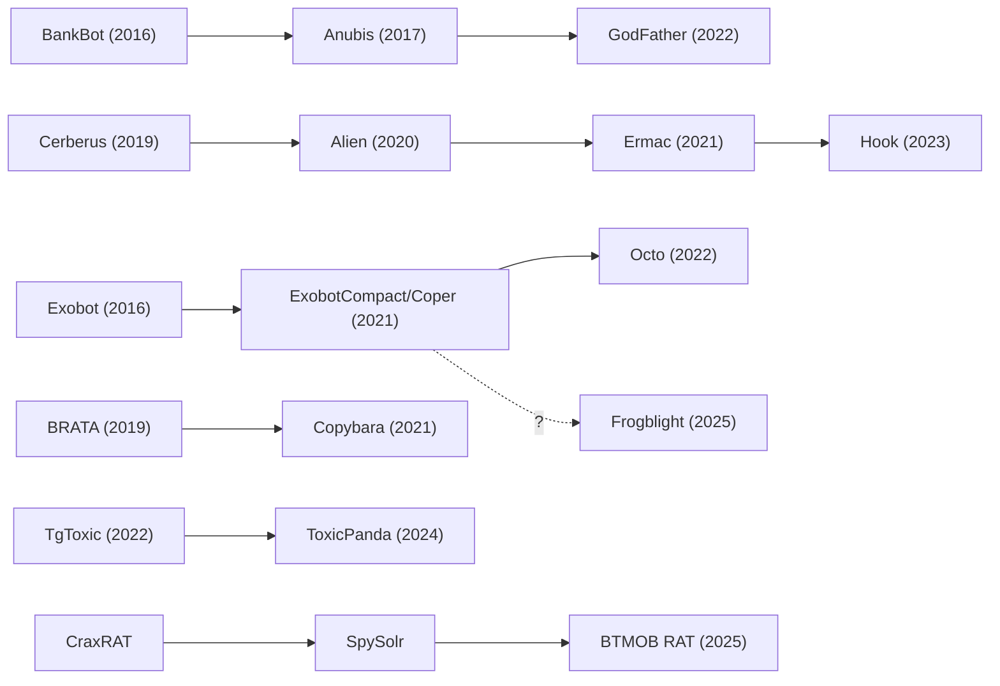

# Malware Families

Individual write-ups on notable Android malware families. Each entry documents origin, capabilities, distribution, target regions, C2 infrastructure, and links to primary research from the teams who analyzed them.

Families are grouped by primary function. Many overlap categories (a banking trojan may also be spyware). The primary classification reflects their main operational purpose. For how different vendors name the same family, see [Naming Conventions](../naming-conventions.md). For chronological evolution, see [Timeline](../timeline.md).

## Lineage Map

Several families share code lineage. Understanding these relationships is critical for attribution and capability prediction.

## Banking Trojans

The largest and most actively developed category. Modern banking trojans combine [overlay injection](../../attacks/overlay-attacks.md), [accessibility abuse](../../attacks/accessibility-abuse.md), and ATS (Automated Transfer Systems) for on-device fraud.

### Cerberus Lineage

| Family | Active | Origin | Key Innovation |
|--------|--------|--------|----------------|
| [Cerberus](cerberus.md) | 2019-2020 | MaaS | Source leak spawned Alien, Ermac, Hook ecosystem |
| [Alien](alien.md) | 2020-2021 | Cerberus fork | Added notification sniffing, TeamViewer remote access |
| [Ermac](ermac.md) | 2021-2022 | Cerberus/Alien fork | Refined codebase, 467 overlay targets |
| [Hook](hook.md) | 2023-present | Ermac fork | VNC, RAT, ATS in single package |

### Anubis Lineage

| Family | Active | Origin | Key Innovation |
|--------|--------|--------|----------------|
| [BankBot](bankbot.md) | 2016-2018 | Open source | First widely accessible banking trojan source code |
| [Anubis](anubis.md) | 2017-2020 | BankBot evolution | Overlay + keylogger + ransomware combo |
| [GodFather](godfather.md) | 2022-present | Anubis evolution | Dynamic overlays, 400+ targets |

### Exobot Lineage

| Family | Active | Origin | Key Innovation |
|--------|--------|--------|----------------|
| [Octo](octo.md) | 2022-present | ExobotCompact/Coper | Remote access via screen streaming |
| [Frogblight](frogblight.md) | 2025-present | Possible Coper connection | Custom keyboard keylogging, Turkish focus |

### Independent

| Family | Active | Origin | Key Innovation |
|--------|--------|--------|----------------|
| [Albiriox](albiriox.md) | 2025-present | MaaS | Budget MaaS ($650-720/month), 400+ targets, unencrypted TCP C2 |
| [Anatsa](anatsa.md) | 2021-present | Independent | ATS fraud pioneer on Google Play, targets EU banking |
| [Antidot](antidot.md) | 2024-present | Independent | Multi-language overlays, VNC, AppLite corporate variant |
| [BingoMod](bingomod.md) | 2024-present | Independent | Post-fraud device wipe, VNC-based DTO |
| [BRATA](brata.md) | 2019-2022 | Independent | Factory reset after fraud, evidence destruction |
| [Brokewell](brokewell.md) | 2024-present | Independent | Rapid development cycle, "Baron Samedit Marais" |
| [Chameleon](chameleon.md) | 2023-present | Independent | Biometric prompt bypass to force PIN capture |
| [Copybara](copybara.md) | 2021-present | BRATA evolution | Italian-focused, TOAD delivery via vishing |
| [Crocodilus](crocodilus.md) | 2025-present | Independent | Contact list injection, full DTO, 8-country targeting |
| [Gigabud](gigabud.md) | 2022-present | GoldFactory | Screen recording instead of overlays, shared infrastructure with SpyNote |
| [GoldPickaxe](goldpickaxe.md) | 2023-present | GoldFactory | Facial biometric theft for deepfake bank verification bypass |
| [Gustuff](gustuff.md) | 2018-2020 | Independent | Early ATS implementation via accessibility |
| [Herodotus](herodotus.md) | 2025-present | MaaS | Human behavior mimicry during device takeover |
| [Hydra](hydra.md) | 2019-present | MaaS | Persistent MaaS operation, wide affiliate network |
| [Medusa](medusa.md) | 2020-present | MaaS | Screen streaming, keylogging, broad targeting |
| [NGate](ngate.md) | 2024 | Independent | First NFC relay malware, clones payment cards for ATM withdrawal |
| [PixPirate](pixpirate.md) | 2022-present | Independent | Targets Brazil's Pix instant payment system |
| [RatOn](raton.md) | 2025-present | Independent | First to combine NFC relay with ATS |
| [SharkBot](sharkbot.md) | 2021-present | Independent | ATS + DGA + dropper-on-Play pipeline |
| [Sturnus](sturnus.md) | 2025-present | Independent | Encrypted messaging interception via accessibility |
| [ToxicPanda](toxicpanda.md) | 2024-present | TgToxic evolution | EU/LATAM expansion, Chinese-speaking actor |
| [TrickMo](trickmo.md) | 2019-present | TrickBot companion | Fake lockscreen PIN capture, 40+ C2 variants |
| [TsarBot](tsarbot.md) | 2025-present | Independent | 750+ app targets, WebSocket C2, fake lockscreen |
| [Vultur](vultur.md) | 2021-present | Independent | Screen streaming over overlays, AlphaVNC |
| [Xenomorph](xenomorph.md) | 2022-present | Independent | Rapid feature iteration, ATS engine |

### Regional Banking Trojans

| Family | Active | Region | Key Innovation |
|--------|--------|--------|----------------|
| [Fakecalls](fakecalls.md) | 2022-present | South Korea | Voice call interception, IVR impersonation |
| [FluHorse](fluhorse.md) | 2022-present | East Asia (Taiwan, Vietnam) | Flutter-based, Dart AOT in libapp.so defeats standard decompilers |
| [Frogblight](frogblight.md) | 2025-present | Turkey | Custom keyboard keylogging, geofencing |
| [BlankBot](blankbot.md) | 2024-present | Turkey | Custom keyboard keylogging, under active development |
| [Klopatra](klopatra.md) | 2025-present | Turkey | Virbox packer, nighttime ODF attacks |
| [Mamont](mamont.md) | 2024-present | Russia | Highest-volume banker in 2024, notification interception |
| [SoumniBot](soumnibot.md) | 2024-present | South Korea | Novel manifest obfuscation techniques |
| [DeVixor](devixor.md) | 2025-present | Iran | Banking RAT with ransomware, 700+ samples, TRON ransom payments |
| [Zanubis](zanubis.md) | 2022-present | Peru | Government (SUNAT) impersonation |

## SMS and Toll Fraud

Monetize through premium SMS, WAP billing, or subscription fraud. Often distributed through Google Play using dropper techniques.

| Family | Active | Key Innovation |
|--------|--------|----------------|
| [Joker](joker.md) | 2017-present | Most persistent Play Store threat, thousands of variants |
| [FluBot](flubot.md) | 2020-2022 | SMS worm with explosive spread, law enforcement takedown |
| [Harly](harly.md) | 2020-present | Subscription fraud via invisible WebView |
| [GriftHorse](grifthorse.md) | 2020-2021 | Premium SMS at scale, 10M+ victims |

## Smishing and Distribution

Families whose primary capability is SMS-based propagation and phishing delivery.

| Family | Active | Key Innovation |
|--------|--------|----------------|
| [MoqHao](moqhao.md) | 2018-present | Longest-running mobile smishing operation, auto-execution (2024) |

## Spyware and Surveillance

Commercial or state-sponsored implants designed for targeted surveillance. Distinct from banking trojans in purpose (intelligence collection vs financial theft) and distribution (targeted delivery vs mass campaigns).

| Family | Active | Operator | Key Capability |
|--------|--------|----------|----------------|
| [Pegasus](pegasus.md) | 2016-present | NSO Group (Israel) | Zero-click exploits, full device compromise |
| [Predator](predator.md) | 2019-present | Cytrox/Intellexa (EU) | Exploit chain delivery, modular implant |
| [FinSpy](finspy.md) | 2012-2022 | FinFisher (Germany) | Commercial lawful intercept, heavily obfuscated |
| [Hermit](hermit.md) | 2019-present | RCS Lab (Italy) | ISP-level delivery via network injection |
| [KoSpy](kospy.md) | 2022-present | ScarCruft/APT37 (DPRK) | Firebase Firestore C2 config, plugin-based surveillance |
| [LightSpy](lightspy.md) | 2020-present | APT41 (China) | 14+ plugin modular framework, WeChat Pay theft, cross-platform |
| [AridSpy](aridspy.md) | 2024-present | Arid Viper/APT-C-23 (Palestinian) | Multi-stage trojanized messaging apps |
| [BoneSpy](bonespy.md) | 2021-present | Sandcat (Uzbekistan SSS) | DroidWatcher-based, SMS command control |
| [EagleMsgSpy](eaglemsgspy.md) | 2017-present | Chinese public security bureaus | Lawful intercept, physical access install, chat app interception |
| [GuardZoo](guardzoo.md) | 2019-present | Houthi-aligned (Yemen) | Military GPS/mapping file collection, 450+ victims |
| [Mandrake](mandrake.md) | 2016-present | Unknown | Multi-year Play Store presence, OLLVM obfuscation |
| [DCHSpy](dchspy.md) | 2021-present | MuddyWater/MOIS (Iran) | VPN/StarLink lures, SFTP exfiltration, targets Iranian dissidents |
| [PlainGnome](plaingnome.md) | 2024-present | Sandcat (Uzbekistan SSS) | Custom-built, two-stage dropper, screen-off audio recording |

## Cryptocurrency Stealers

Families targeting cryptocurrency wallets through OCR-based seed phrase theft from device photos.

| Family | Active | Key Innovation |
|--------|--------|----------------|
| [SparkCat](sparkcat.md) | 2024-present | First OCR stealer on both Play Store and App Store |
| [SpyAgent](spyagent.md) | 2024-present | 280+ fake apps, OCR seed phrase theft targeting Korea |

## Supply Chain and SDK Malware

Malicious code distributed through compromised SDKs or pre-installed in firmware.

| Family | Active | Key Innovation |
|--------|--------|----------------|
| [Triada](triada.md) | 2016-present | Pre-installed in firmware, modular, ad fraud + backdoor |
| [Necro](necro.md) | 2024-present | Steganographic payload delivery, compromised Coral SDK |
| [Goldoson](goldoson.md) | 2023 | 100M+ installs via malicious SDK in 60+ legitimate apps |

## Predatory Apps

Applications that operate as malware through excessive data collection and weaponization of personal information.

| Family | Active | Key Innovation |
|--------|--------|----------------|
| [SpyLoan](spyloan.md) | 2020-present | Predatory lending apps, data used for harassment/extortion |

## NFC Relay

An emerging attack category using NFC relay to clone contactless payment cards for ATM cash withdrawal or POS fraud.

| Family | Active | Key Innovation |
|--------|--------|----------------|
| [NGate](ngate.md) | 2024 | First Android NFC relay malware, clones cards via NFCGate |
| [RatOn](raton.md) | 2025-present | First to combine NFC relay with ATS for automated fraud |

## RATs (Remote Access Trojans)

General-purpose remote access tools providing full device control without specialized financial fraud features.

| Family | Active | Key Innovation |
|--------|--------|----------------|
| [BTMOB RAT](btmob.md) | 2025-present | MaaS RAT, WebView injection, Media Projection screen streaming |
| [SpyNote](spynote.md) | 2016-present | Free/cheap RAT builder, massive operator base |
| [Rafel RAT](rafelrat.md) | 2022-present | Open-source RAT, 120+ campaigns, ransomware capability |
| [FireScam](firescam.md) | 2025-present | Info-stealer via fake RuStore/Telegram Premium, Firebase C2 and exfiltration |
| [PJobRAT](pjobrat.md) | 2021-present | Military-targeting RAT, India then Taiwan campaigns |
