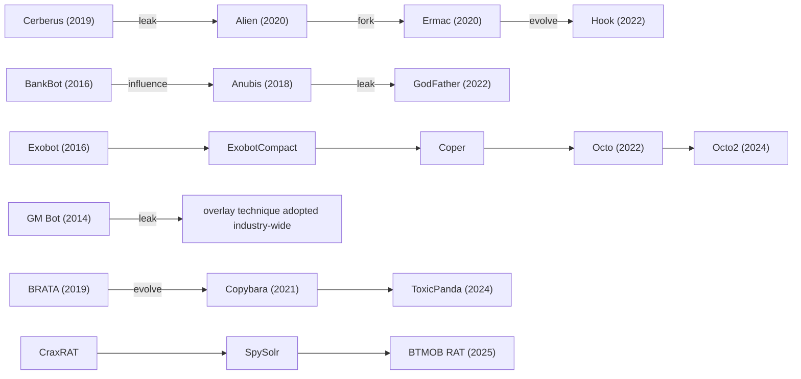
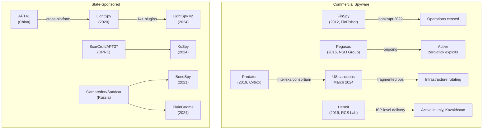
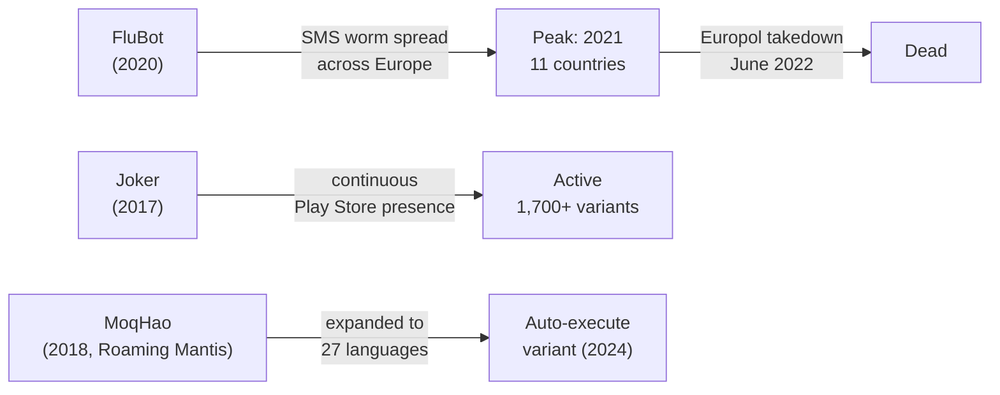

# Android Malware

The Android malware landscape from its earliest trojans to modern banking malware with full device takeover. This section documents how Android malware works, how it evolved, and the techniques that define each generation.

## Structure

| Page | Content |
|------|---------|
| [Timeline](timeline.md) | Chronological evolution of Android malware: key families, milestones, how techniques spread |
| [Naming Conventions](naming-conventions.md) | How different security vendors name the same malware, and how to map between naming schemes |
| [Grayware & Data Harvesting](../grayware/index.md) | Data broker SDKs, stalkerware, ad fraud, fleeceware, predatory lending apps -- the gray area between aggressive monetization and malware |
| [Threat Actors](threat-actors.md) | MaaS operators, state-sponsored groups, regional criminal organizations, and solo developers behind Android malware |
| [Families](families/index.md) | Individual write-ups on notable malware families: behaviors, permissions, techniques, packers, IOCs |

!!! warning "Key Insight"
    [Accessibility Service abuse](../attacks/accessibility-abuse.md) is nearly universal in modern banking trojans and is the single most critical permission for malware operations. It enables overlay injection, keylogging, ATS fraud, screen reading, and self-granted permissions -- making it the foundation that most other attack techniques depend on.

## Landscape Overview

### By Category

| Category | Count | Description |
|----------|-------|-------------|
| Banking trojans (MaaS) | 25+ | [Overlay attacks](../attacks/overlay-attacks.md), [ATS](../attacks/automated-transfer-systems.md), VNC/DTO. Sold as subscriptions ($3k--$10k/month) |
| Regional bankers | 10+ | Single-country targeting with local financial system knowledge |
| SMS/toll fraud | 5+ | Premium SMS, [WAP billing, subscription fraud](../attacks/sms-interception.md) |
| Spyware/surveillance | 15+ | State-sponsored and commercial. [Screen capture](../attacks/screen-capture.md), [keylogging](../attacks/keylogging.md), targeted deployment |
| RATs | 5+ | General-purpose remote access. Builder-based or open-source |
| Supply chain | 3+ | Malicious SDKs, compromised apps. [Dynamic code loading](../attacks/dynamic-code-loading.md) via Play Store |
| Crypto stealers | 3+ | OCR seed phrase theft, [clipboard hijacking](../attacks/clipboard-hijacking.md) |

### Major Lineages

Android malware families frequently share code through source leaks, MaaS rebranding, and direct evolution:

### 2024-2025 Trends

| Trend | Examples |
|-------|---------|
| Reduced permission footprints | [Medusa](families/medusa.md) v2 dropped from 21 to 5 permissions |
| NFC relay attacks | [NGate](families/ngate.md), [RatOn](families/raton.md) clone contactless payment cards |
| OCR-based crypto theft | [SparkCat](families/sparkcat.md), [SpyAgent](families/spyagent.md) scan photos for seed phrases |
| Commercial packer adoption | [Klopatra](families/klopatra.md), [Gigabud](families/gigabud.md) use Virbox for anti-analysis |
| On-device virtualization | [GodFather](families/godfather.md) v3 installs real banking apps inside VirtualApp sandbox |
| Fake lockscreen PIN capture | [TrickMo](families/trickmo.md), [TsarBot](families/tsarbot.md) steal device PINs via fake lockscreens |
| Human behavior mimicry | [Herodotus](families/herodotus.md) types with natural delays to evade behavioral biometrics |
| Firebase as C2 | [KoSpy](families/kospy.md), [FireScam](families/firescam.md), [DeVixor](families/devixor.md) use Firebase infrastructure |

!!! tip "Most Impactful Trend"
    [NFC relay attacks](../attacks/nfc-relay.md) represent a paradigm shift -- malware like [NGate](families/ngate.md) and [RatOn](families/raton.md) can clone contactless payment cards remotely, bridging the gap between digital compromise and physical-world fraud at ATMs and POS terminals.

### Geographic Hotspots

| Region | Dominant Families | Distribution |
|--------|-------------------|-------------|
| Europe (Western) | [Anatsa](families/anatsa.md), [Octo](families/octo.md), [Medusa](families/medusa.md), [Vultur](families/vultur.md) | Play Store droppers |
| Europe (Southern) | [Copybara](families/copybara.md), [Sturnus](families/sturnus.md), [Herodotus](families/herodotus.md) | Vishing (TOAD), smishing |
| Turkey | [Frogblight](families/frogblight.md), [BlankBot](families/blankbot.md), [Klopatra](families/klopatra.md) | Smishing, phishing pages |
| Russia/CIS | [Mamont](families/mamont.md), [FireScam](families/firescam.md) | Fake parcel tracking, fake RuStore |
| Iran | [DeVixor](families/devixor.md), [DCHSpy](families/dchspy.md) | Fake VPN apps, automotive phishing |
| South Korea | [Fakecalls](families/fakecalls.md), [SoumniBot](families/soumnibot.md), [SpyAgent](families/spyagent.md) | Smishing, fake banking apps |
| East Asia | [MoqHao](families/moqhao.md), [FluHorse](families/fluhorse.md) | Smishing (Roaming Mantis), trojanized apps |
| Southeast Asia | [Gigabud](families/gigabud.md), [GoldPickaxe](families/goldpickaxe.md) | Fake government/banking apps |
| India | [SpyLoan](families/spyloan.md), regional banking trojans | Fake loan apps, [MaaS phishing platforms](https://www.mcafee.com/blogs/other-blogs/mcafee-labs/android-phishing-scam-using-malware-as-a-service-on-the-rise-in-india/), smishing |
| Latin America | [PixPirate](families/pixpirate.md), [ToxicPanda](families/toxicpanda.md), [Zanubis](families/zanubis.md) | WhatsApp lures, social engineering |
| Middle East | [GuardZoo](families/guardzoo.md), [AridSpy](families/aridspy.md) | Trojanized messaging apps |

## Detailed Lineage Maps

### Banking Trojan Evolution

The banking trojan ecosystem is defined by source code leaks and direct inheritance. The [Cerberus](families/cerberus.md) leak in September 2020 was the single most impactful event, seeding three successor families.

```mermaid
graph TD
    subgraph Cerberus Lineage
        Cerberus["Cerberus<br/>(2019)"] -->|"source leak<br/>Sept 2020"| Alien["Alien<br/>(2020)"]
        Alien -->|"fork by DukeEugene"| Ermac["ERMAC<br/>(2021)"]
        Ermac -->|"evolve + VNC"| Hook["Hook<br/>(2022)"]
        Hook -->|"v2 + WebSocket"| HookV2["Hook v2<br/>(2023)"]
    end

    subgraph Exobot Lineage
        Exobot["Exobot<br/>(2016)"] -->|"lite version"| ExobotCompact["ExobotCompact<br/>(2019)"]
        ExobotCompact -->|"rebrand"| Coper["Coper<br/>(2021)"]
        Coper -->|"rebrand by ThreatFabric"| Octo["Octo<br/>(2022)"]
        Octo -->|"DGA + encrypted C2"| Octo2["Octo2<br/>(2024)"]
    end

    subgraph Anubis Lineage
        GMBot["GM Bot<br/>(2014)"] -->|"overlay concept"| BankBot["BankBot<br/>(2016)"]
        BankBot -->|"influenced"| Anubis["Anubis<br/>(2018)"]
        Anubis -->|"source leak 2019"| GodFather["GodFather<br/>(2022)"]
        GodFather -->|"VirtualApp sandbox"| GodFatherV3["GodFather v3<br/>(2024)"]
    end

    subgraph BRATA Lineage
        BRATA["BRATA<br/>(2019)"] -->|"evolved by same actor"| Copybara["Copybara<br/>(2021)"]
        Copybara -->|"rebranded for LATAM"| ToxicPanda["ToxicPanda<br/>(2024)"]
    end

    subgraph Independent Lines
        Medusa1["Medusa v1<br/>(2020)"] -->|"reduced permissions"| Medusa2["Medusa v2<br/>(2024)"]
        Xeno1["Xenomorph v1<br/>(2022)"] -->|"added ATS"| Xeno2["Xenomorph v2"] -->|"ATS engine"| Xeno3["Xenomorph v3<br/>(2023)"]
        Vultur1["Vultur v1<br/>(2021)"] -->|"added screen streaming"| Vultur2["Vultur v2<br/>(2024)"]
        CraxRAT --> SpySolr --> BTMOB["BTMOB RAT<br/>(2025)"]
    end
```

### Spyware Evolution

Commercial and state-sponsored spyware follows a different lifecycle. Distribution is targeted (not mass), capabilities are deeper (kernel-level), and operators face legal consequences.

### SMS Worm and Toll Fraud

SMS-based malware peaked around 2020-2022 with [FluBot](families/flubot.md)'s worm-like spreading mechanism. Law enforcement intervention proved effective in this category.

## Source Code Leaks

Source code leaks fundamentally reshape the threat landscape. A single leak can spawn multiple successor families and reduce the barrier to entry for new operators.

| Date | Family | What Happened | Impact |
|------|--------|---------------|--------|
| 2017 | GM Bot | Source leaked on underground forums | Pioneered overlay technique; code reused across dozens of families |
| 2019 | [Anubis](families/anubis.md) | Source code leaked after developer arrest | Enabled [GodFather](families/godfather.md) and numerous low-tier forks targeting specific regions |
| Sept 2020 | [Cerberus](families/cerberus.md) | Developer failed to auction, released source free on forums | Most impactful Android malware leak. Seeded [Alien](families/alien.md), [ERMAC](families/ermac.md), [Hook](families/hook.md). [ThreatFabric](https://www.threatfabric.com/blogs/cerberus-a-new-banking-trojan-from-the-underworld) documented the cascade |
| 2021 | [SpyNote](families/spynote.md) | Builder leaked publicly | Explosion of SpyNote variants; accessible to low-skill operators. [Zimperium](https://www.zimperium.com/blog/spynote-a-growing-threat-in-mobile-security/) tracked post-leak proliferation |
| 2022 | [BRATA](families/brata.md) | Partial source circulated | Influenced [Copybara](families/copybara.md) development |
| 2023 | [Rafel RAT](families/rafelrat.md) | Open-source release | [Check Point](https://research.checkpoint.com/2024/rafel-rat-android-malware/) documented 120+ campaigns across 10 threat actors using Rafel RAT |
| 2024 | CraxRAT | Builder sold then leaked | Led to SpySolr fork, then [BTMOB RAT](families/btmob.md) |

## Law Enforcement Actions

Law enforcement actions against mobile malware are rare but impactful when they occur. Most "takedowns" are Google removing apps from the Play Store after vendor publications.

| Date | Operation | Target | Outcome | Source |
|------|-----------|--------|---------|--------|
| June 2022 | Europol/Dutch Police | [FluBot](families/flubot.md) infrastructure | Infrastructure seized across 11 countries. FluBot did not resurface. One of the most successful mobile malware takedowns. | [Europol](https://www.europol.europa.eu/media-press/newsroom/news/takedown-of-flubot-spyware-network-in-international-law-enforcement-operation) |
| 2022 | German authorities | FinFisher GmbH | [FinSpy](families/finspy.md) vendor filed bankruptcy after investigation into sales to authoritarian regimes. Operations ceased. | [Netzpolitik.org](https://netzpolitik.org/2022/finfisher-is-dead/) |
| March 2024 | US Treasury OFAC | Intellexa Consortium | Sanctions on entities and individuals behind [Predator](families/predator.md) spyware. First financial sanctions targeting a commercial spyware vendor. | [US Treasury](https://home.treasury.gov/news/press-releases/jy2155) |
| March 2024 | Joint (FBI/Europol) | Blackphone encrypted network | Infrastructure used by multiple Android malware operators. Disrupted but not fully dismantled. | [Europol](https://www.europol.europa.eu/) |
| 2024 | Google TAG + Mandiant | [Predator](families/predator.md) infrastructure | Technical disruption of Predator delivery infrastructure and exploit chains. Intellexa fragmented to new hosting. | [Google TAG](https://blog.google/threat-analysis-group/) |

## By Behavior

Malware families are also cross-referenced from [Attack Techniques](../attacks/index.md) based on observed behaviors: overlay attacks, accessibility abuse, SMS interception, NFC relay, etc. [Permission pages](../permissions/index.md) document which families abuse each Android permission.
