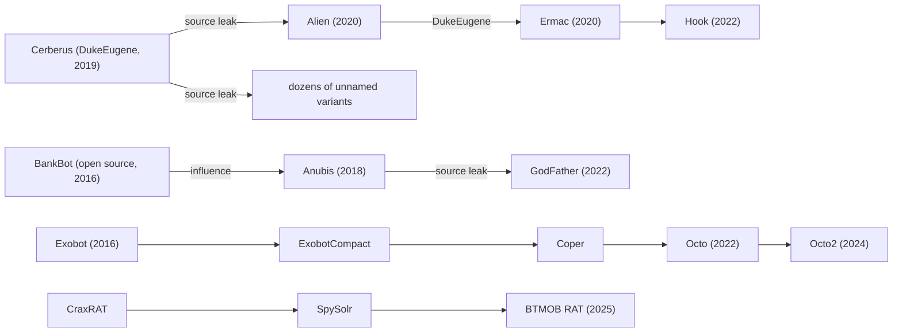

# Threat Actors

The Android malware ecosystem is operated by distinct categories of threat actors ranging from nation-state intelligence agencies to solo developers selling RAT builders on Telegram. Understanding who builds and deploys Android malware, and why, is essential for attribution, threat modeling, and predicting what comes next.

## MaaS Operators (Malware-as-a-Service)

The dominant business model in Android banking malware. A developer builds and maintains the malware, panel, and inject kits. Operators rent access on a monthly subscription and deploy the malware against their own target set. The developer provides updates, support, and evasion patches through private Telegram channels.

### Business Model

1. Developer advertises on underground forums (XSS, Exploit.in) and Telegram
2. Operator pays monthly subscription for panel access, APK builder, and inject kit
3. Operator handles distribution: smishing campaigns, Play Store droppers, social engineering
4. Stolen credentials flow through the panel to the operator
5. Operator monetizes via money mule networks, SIM swaps, or direct account takeover
6. Developer earns recurring revenue from multiple simultaneous operators

The developer-operator split means a single malware family may target different countries simultaneously depending on which operators are active. Attribution to a specific criminal group requires identifying the operator, not just the malware family.

### Pricing

Prices sourced from underground advertisements and open-source threat intelligence reporting. See [MaaS Economy](../industry/index.md) for full market context.

| Family | Monthly Price | Key Features | Developer / Group |
|--------|--------------|--------------|-------------------|
| [Hook](families/hook.md) | $7,000 | VNC, RAT, accessibility abuse, keylogging | DukeEugene |
| [BTMOB RAT](families/btmob.md) | $5,000-$10,000 | Evolved from CraxRAT/SpySolr lineage | Unknown |
| [Cerberus](families/cerberus.md) | $4,000 (pre-leak) | Overlays, keylogging, 2FA theft | Leaked September 2020 |
| [Ermac](families/ermac.md) | $3,000 | Fork of Alien/Cerberus, 467 inject targets | DukeEugene |
| [GodFather](families/godfather.md) | $3,000-$5,000 (est.) | Overlays, VNC, VirtualApp sandboxing | Unknown (Anubis lineage) |
| [Octo](families/octo.md) / Octo2 | $2,000 | Remote access, keylogging, DGA in v2 | "Architect" (Octo2) |
| [Xenomorph](families/xenomorph.md) | $2,000-$3,000 (est.) | ATS engine, 400+ bank targets | Hadoken Security Group |
| [Medusa](families/medusa.md) | $2,000-$4,000 (est.) | VNC, keylogging, minimal permissions in v2 | Multiple operators |
| [Anatsa](families/anatsa.md) | Private (not publicly sold) | ATS-based, Play Store droppers | Unknown |
| [Albiriox](families/albiriox.md) | $650-$720 | Budget tier, basic overlay + keylogging | Unknown |

### Infrastructure

| Component | Typical Setup |
|-----------|---------------|
| Sales channel | Private Telegram groups, XSS Forum, Exploit.in |
| C2 hosting | Bulletproof hosting providers, frequently rotated domains |
| Panel | PHP/Laravel web app, sometimes hardened with IP whitelisting |
| Builder | Desktop or web-based APK generator with obfuscation options |
| Inject kits | HTML/CSS overlay pages, sold per-bank or as regional bundles |
| Money flow | Cryptocurrency (Monero preferred, Bitcoin accepted), Telegram escrow |
| Support | 24/7 Telegram support channel, update announcements, bug tracking |

### MaaS Lineage Chains

MaaS families are interconnected through source leaks, developer movement, and direct evolution:

The Cerberus leak was the most consequential single event. It seeded multiple families and lowered the barrier for new entrants. Any sample with Cerberus-derived code may be operated by entirely unrelated groups.

## State-Sponsored / APT

Government-backed actors deploying Android malware for intelligence collection, surveillance of dissidents and journalists, or military operations. Capabilities range from zero-click exploits to basic RATs, depending on the actor's resources and objectives.

### Commercial Spyware Vendors

These companies develop and sell mobile exploitation tools to government clients. They occupy a legal gray area: marketed as "lawful intercept" tools, but repeatedly documented targeting journalists, activists, and political opposition.

| Vendor | Country | Product | Status | Family Page |
|--------|---------|---------|--------|-------------|
| NSO Group | Israel | Pegasus | Active, US Entity List since 2021 | [Pegasus](families/pegasus.md) |
| Cytrox / Intellexa | North Macedonia / Ireland | Predator | Sanctioned by US Treasury 2024, fragmented operations | [Predator](families/predator.md) |
| Gamma Group / FinFisher | UK / Germany | FinSpy | Bankrupt 2022, some operations may continue under different entities | [FinSpy](families/finspy.md) |
| Paragon Solutions | Israel | Graphite | Active, less publicly documented than NSO |  |
| QuaDream | Israel | Reign | Shut down April 2023 after Citizen Lab / Microsoft exposure |  |
| Candiru | Israel | DevilsTongue | US Entity List since 2021, primarily Windows/browser focused |  |

**NSO Group (Pegasus)**: The benchmark for mobile exploitation. Zero-click exploit chains targeting iMessage, WhatsApp, and Android browser engines. Sold to 40+ government clients. Documented on the phones of heads of state, journalists (Jamal Khashoggi associates), human rights defenders, and opposition politicians across dozens of countries. See [Pegasus](families/pegasus.md) for full technical analysis.

**Cytrox/Intellexa (Predator)**: One-click exploit chains delivered via links. Intellexa Consortium operated across multiple EU jurisdictions to evade export controls. Google TAG documented Predator exploiting five Android zero-days in 2021 (CVE-2021-37973, CVE-2021-37976, CVE-2021-38000, CVE-2021-38003, CVE-2021-1048). US Treasury sanctions in March 2024 targeted individuals and entities in the consortium. See [Predator](families/predator.md).

**Gamma Group (FinSpy/FinFisher)**: Sold to governments including Ethiopia, Bahrain, and Turkey for targeting dissidents. FinSpy Android implant used accessibility abuse, root exploits, and DexClassLoader for modular payload delivery. FinFisher GmbH filed for insolvency in 2022 after sustained legal pressure. See [FinSpy](families/finspy.md).

### Nation-State Groups

| Group | Nation | Primary Targets | Android Tools |
|-------|--------|-----------------|---------------|
| MuddyWater / MOIS | Iran | Iranian dissidents, regional adversaries | [DCHSpy](families/dchspy.md) targeting Iranian citizens via fake VPN apps |
| Gamaredon / Primitive Bear | Russia (FSB) | Ukrainian military, government officials | BoneSpy, PlainGnome targeting Ukrainian military personnel |
| Sandworm / Seashell Blizzard | Russia (GRU) | Ukrainian infrastructure, NATO | Limited Android operations, primarily infrastructure-focused |
| APT-C-23 / Arid Viper | Palestine (Hamas-linked) | Israeli and Palestinian targets | [AridSpy](families/aridspy.md) via trojanized messaging apps |
| Transparent Tribe / APT36 | Pakistan (ISI-linked) | Indian military and government | [PJobRAT](families/pjobrat.md), CapraRAT targeting Indian defense personnel |
| ScarCruft / APT37 | North Korea | South Korean defectors, journalists | RambleOn, FastViewer targeting South Korean users |
| Sun Team | North Korea | North Korean defectors | [RedDawn campaign](https://www.mcafee.com/blogs/other-blogs/mcafee-labs/malware-on-google-play-targets-north-korean-defectors/): fake apps on Google Play stealing photos, contacts, SMS. [Also targeted via KakaoTalk](https://www.mcafee.com/blogs/other-blogs/mcafee-labs/north-korean-defectors-journalists-targeted-using-social-networks-kakaotalk/) social engineering. |
| Kimsuky / APT43 | North Korea | South Korean think tanks, diplomats | [KoSpy](families/kospy.md) via fake utility apps |
| Houthi-linked operators | Yemen | Yemeni military targets | [GuardZoo](families/guardzoo.md) via trojanized mapping apps |
| Chinese PSB (Public Security Bureau) | China | Domestic surveillance, Uyghurs, Tibetans | [EagleMsgSpy](families/eaglemsgspy.md), custom surveillance tools |

### Attribution Challenges

State-sponsored Android malware attribution is complicated by several factors:

- Commercial spyware is sold to many governments, so discovering Pegasus on a device does not identify which government deployed it without infrastructure analysis
- Nation-state groups frequently use modified open-source tools (Metasploit, SpyNote forks) that are also used by criminals
- Infrastructure overlaps occur when groups share bulletproof hosting providers or VPN services
- False flag operations deliberately mimic other groups' tooling and infrastructure
- The line between "state-sponsored" and "state-tolerated" is blurred, particularly for Russian and Chinese operations where criminal groups operate with implicit government permission

## Regional Criminal Groups

Organized cybercrime groups operating Android malware with specific regional targeting. These groups are more sophisticated than solo developers but typically focused on a single malware family or geographic region.

### GoldFactory

**Origin**: China-nexus, targeting Southeast Asia and APAC.

**Operations**: Develops and operates banking trojans targeting Thai, Vietnamese, and broader APAC financial institutions. Uses [Virbox](../packers/virbox.md) commercial packer for anti-analysis. Known for combining traditional banking trojan techniques with biometric theft.

**Families**:

- [Gigabud](families/gigabud.md): Android banking trojan targeting Thai and APAC banks, Virbox-packed, overlay attacks with screen recording
- [GoldPickaxe](families/goldpickaxe.md): Steals facial biometrics to bypass bank liveness checks in Thailand and Vietnam, also targets iOS via MDM profiles

**Distinguishing traits**: Heavy use of commercial packers, biometric theft as a differentiator, cross-platform (Android + iOS) operations.

### Hadoken Security Group

**Origin**: Believed European-based.

**Operations**: Developed and operated [Xenomorph](families/xenomorph.md) as a MaaS offering. The group progressed from basic overlay banking trojan to a full ATS (Automated Transfer System) engine with 400+ bank targets across Europe, US, and APAC.

**Families**:

- [Xenomorph](families/xenomorph.md): Three major versions. v1 (2022) basic overlays. v2 added C2 protocol updates. v3 (2023) introduced ATS engine for automated on-device fraud.

**Distinguishing traits**: Rapid iteration cycle, public-facing development activity, transitioned from MaaS to potentially operating independently.

### DukeEugene

**Origin**: Russian-speaking threat actor.

**Operations**: The most prolific single developer in the Android MaaS ecosystem. Created [Cerberus](families/cerberus.md) (2019), attempted to auction the source code, then leaked it for free when the auction failed (September 2020). Subsequently developed [Ermac](families/ermac.md) (2020) and [Hook](families/hook.md) (2022), each building on the previous codebase with new features. Advertised and sold through Telegram and underground forums.

**Families**:

- [Cerberus](families/cerberus.md): Original MaaS banking trojan, overlay attacks, keylogging
- [Ermac](families/ermac.md): Cerberus fork via Alien, 467 banking app targets
- [Hook](families/hook.md): Premium-tier evolution with VNC, RAT, $7,000/month

**Distinguishing traits**: Consistent code lineage across three families, premium pricing strategy, prolific advertising on underground forums.

### Neo_Net

**Origin**: Spanish-speaking operator (Mexico-based per research).

**Operations**: Targeted Spanish and Latin American banks with relatively simple SMS phishing campaigns combined with Android malware. Despite using unsophisticated tools, successfully compromised thousands of victims. Operated from 2021 through at least 2023.

**Distinguishing traits**: Low technical sophistication compensated by high-volume social engineering, Spanish-language targeting, combined smishing with credential-stealing APKs.

### Roaming Mantis

**Origin**: East Asian threat group (China-nexus suspected).

**Operations**: Long-running operation primarily targeting Japan and South Korea through massive smishing campaigns. Known for DNS hijacking on compromised routers to redirect victims to malicious APK downloads. Operations expanded to Europe and other regions over time.

**Families**:

- [MoqHao](families/moqhao.md) (also known as Wroba, XLoader): SMS worm with banking credential theft, DNS hijacking, multi-region targeting

**Distinguishing traits**: SMS-based propagation (worm-like behavior), DNS hijacking for distribution, long operational lifespan (active since 2018+), geographic expansion from East Asia to global.

### BRATA / Copybara Operators

**Origin**: Italian-focused criminal group(s).

**Operations**: Evolved from the original [BRATA](families/brata.md) banking trojan (Brazilian origin, later repurposed for Italian banks) to the [Copybara](families/copybara.md) family targeting Italian financial institutions. Primarily uses vishing (voice phishing / TOAD - Telephone-Oriented Attack Delivery) for distribution, calling victims while impersonating bank staff.

**Families**:

- [BRATA](families/brata.md): Factory reset after fraud, GPS tracking, SMS interception
- [Copybara](families/copybara.md): VNC-based on-device fraud, Italian bank targeting
- [ToxicPanda](families/toxicpanda.md): Further evolution targeting Italian and Latin American banks

**Distinguishing traits**: Vishing-based distribution, Italy-focused targeting, progressive code evolution across three named families, factory reset as anti-forensic technique.

### InTheBox

**Origin**: Russian-speaking threat actor.

**Operations**: Not a malware developer but the dominant inject kit vendor in the Android MaaS ecosystem. Sells HTML overlay pages (webinjects) that mimic banking apps, crypto wallets, and payment platforms. Operates a dedicated marketplace offering per-bank and bundled inject kits compatible with major MaaS families.

**Distinguishing traits**: Specialization in inject kits rather than malware itself, supply chain role supporting multiple MaaS operators, 1,000+ banking app overlays in catalog.

## Solo Developers / Small Teams

Individual developers or small teams building and selling Android RATs and malware through Telegram and underground forums. Lower sophistication than MaaS operations but responsible for a significant volume of infections due to low cost and accessibility.

### Open Source / Leaked Tool Ecosystem

| Tool | Status | Usage |
|------|--------|-------|
| [Rafel RAT](families/rafelrat.md) | Open source on GitHub | Widely used by low-skill operators, Check Point documented 120+ campaigns using Rafel |
| [SpyNote](families/spynote.md) (cracked) | Leaked/cracked builder circulating freely | Originally commercial ($200-$500), cracked versions enable mass adoption |
| AhMyth | Open source | Academic RAT project repurposed for malicious use |
| L3MON | Open source | Node.js-based Android RAT, simple deployment |
| AndroRAT | Open source | One of the earliest Android RATs, still used in modified forms |
| CraxRAT | Cracked builder | Evolved into SpySolr and [BTMOB RAT](families/btmob.md) |

The availability of free and cracked tools means that anyone with basic technical skills can deploy an Android RAT. The resulting infections are typically unsophisticated but high-volume. Check Point's research on Rafel RAT found it deployed against military targets, government entities, and ordinary users across 120+ campaigns, demonstrating that even basic tools can reach high-value targets through social engineering.

### Telegram-Based Operations

Telegram is the primary marketplace and communication channel for small-scale Android malware operations:

- **Builder sales**: Developers sell RAT builders for $50-$500 one-time or $20-$100/month
- **Cracked tools**: Channels distribute cracked versions of commercial tools
- **Tutorials**: Step-by-step guides for building and deploying Android malware
- **Victim logs**: Operators share screenshots of active bots as proof of capability
- **Mule recruitment**: Money mule and drop account recruitment for monetization

### DeVixor

A notable example of a solo developer operating publicly. The [DeVixor](families/devixor.md) developer shares development updates, feature additions, and victim statistics on Telegram. Targets Iranian users through fake VPN apps, exploiting demand for censorship circumvention tools. The public nature of the operation illustrates the low perceived risk for operators in certain jurisdictions.

## Data Harvesting Operations

Not traditional malware operators but commercial entities conducting data collection at scale through SDK integration, ad-tech infrastructure, and dual-use applications. These operations collect more data from more devices than most malware campaigns, but operate under the cover of privacy policies and terms of service.

Detailed coverage in [Grayware & Data Harvesting](../grayware/index.md).

### Key Actors

| Entity | Method | Scale | Status |
|--------|--------|-------|--------|
| X-Mode / Outlogic | Location SDK in 400+ apps | Millions of devices | FTC action 2024 |
| Measurement Systems | Data harvesting SDK | 60M+ downloads | Removed from Play Store 2022, reappeared |
| Gravy Analytics | RTB data + SDKs | Millions of devices | Hacked January 2025, data exposed |
| Sensor Tower | VPN apps as data collection | Millions of devices | Exposed by BuzzFeed 2020 |
| Patternz / ISA | Ad network as surveillance front | Claims 600K app reach | Exposed 2024 |
| Predicio | Location SDK | Unknown scale | Linked to Gravy Analytics breach |

### Overlap with State Actors

The data harvesting ecosystem intersects with government surveillance in documented ways:

- X-Mode sold location data to US military contractors (DIA, through intermediaries)
- Measurement Systems SDK was linked to a Virginia company connected to Packet Forensics, a lawful intercept equipment vendor
- Babel Street (Locate X) purchased commercial location data for use by US government agencies including CBP and ICE
- The NSA and other intelligence agencies have acknowledged purchasing commercially available location data
- Patternz explicitly marketed SDK-sourced data for intelligence applications

This creates a parallel surveillance channel that bypasses the legal frameworks governing traditional signals intelligence. Instead of intercepting communications through warranted collection, agencies purchase data that was "consented to" through app privacy policies that no one reads.

## Attribution Resources

Mapping samples to threat actors requires correlating technical indicators with operational patterns.

| Indicator Type | What It Reveals |
|----------------|-----------------|
| Code overlap / shared libraries | Family lineage and developer identity |
| C2 infrastructure (IP, domain, TLS cert) | Operator identity, potentially shared across campaigns |
| Inject kit style and target list | Regional focus, possible inject kit vendor (InTheBox) |
| Packer/obfuscation choice | Developer preference, budget (commercial vs. free packers) |
| Telegram channel artifacts | Developer identity, customer base, operational schedule |
| Language artifacts in code/panel | Developer origin (Russian strings, Chinese comments, Farsi UI) |
| Distribution pattern | Operator methodology (smishing vs. Play Store vs. social engineering) |
| Target list (banking apps) | Geographic and financial sector focus of the operator |
| Monetization method | Mule networks suggest organized crime; data exfiltration suggests espionage |

### Key Research Sources

| Source | Coverage |
|--------|----------|
| ThreatFabric | MaaS families, developer tracking, underground market monitoring |
| Cleafy | Italian/European banking trojans, vishing operations |
| Citizen Lab | Commercial spyware, state-sponsored surveillance |
| Google TAG | Zero-day exploitation, APT Android campaigns |
| ESET | Broad family coverage, APT campaigns |
| Check Point | RAT ecosystem, open-source tool tracking |
| Kaspersky GReAT | APT campaigns, particularly Russia/CIS-adjacent |
| Cyble | Underground monitoring, MaaS pricing |
| Lookout | Mobile APT, commercial spyware |
| McAfee Mobile Research | Korean/Indian market threats, ad fraud, [MoqHao tracking](https://www.mcafee.com/blogs/other-blogs/mcafee-labs/moqhao-evolution-new-variants-start-automatically-right-after-installation/), [Sun Team attribution](https://www.mcafee.com/blogs/other-blogs/mcafee-labs/malware-on-google-play-targets-north-korean-defectors/) |
