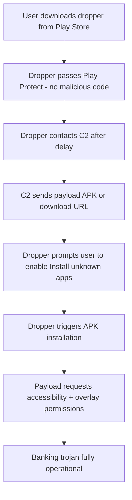

# REQUEST_INSTALL_PACKAGES

The dropper permission. Allows an app to initiate APK installations on the device, making it the key enabler for multi-stage malware delivery. The first-stage app (dropper) passes Google Play Protect because it contains no malicious code. After installation, it downloads the real payload from C2 and triggers installation. The user sees an install confirmation dialog, but social engineering handles that. This permission is central to the dropper-as-a-service (DaaS) model that dominates the Android malware ecosystem.

## Technical Details

| Attribute | Value |
|-----------|-------|
| Permission | `android.permission.REQUEST_INSTALL_PACKAGES` |
| Protection Level | `signature\|appop` |
| Grant Method | Settings > Apps > Special access > Install unknown apps |
| Introduced | API 26 (Android 8.0) |
| Play Store Policy | Restricted to apps with core install functionality since 2022 |

Before Android 8.0, sideloading was controlled by a single global toggle ("Unknown sources") in Settings. Android 8.0 changed this to per-app granularity: each app must be individually authorized to install APKs. Google Play further [restricted this permission in 2022](https://support.google.com/googleplay/android-developer/answer/12085295), limiting it to apps where package installation is core functionality (app stores, enterprise MDM, file managers).

## What It Enables

Two primary installation mechanisms:

### Intent-Based Installation

```java
Intent intent = new Intent(Intent.ACTION_INSTALL_PACKAGE);
intent.setData(Uri.fromFile(apkFile));
intent.putExtra(Intent.EXTRA_NOT_UNKNOWN_SOURCE, true);
intent.putExtra(Intent.EXTRA_RETURN_RESULT, true);
startActivityForResult(intent, REQUEST_CODE);
```

This shows the system install confirmation screen. The user must tap "Install" to proceed.

### Session-Based Installation (PackageInstaller API)

```java
PackageInstaller installer = getPackageManager().getPackageInstaller();
PackageInstaller.SessionParams params = new PackageInstaller.SessionParams(
    PackageInstaller.SessionParams.MODE_FULL_INSTALL
);
int sessionId = installer.createSession(params);

PackageInstaller.Session session = installer.openSession(sessionId);
OutputStream out = session.openWrite("payload", 0, apkBytes.length);
out.write(apkBytes);
out.close();

Intent callbackIntent = new Intent(this, InstallReceiver.class);
PendingIntent pending = PendingIntent.getBroadcast(
    this, sessionId, callbackIntent,
    PendingIntent.FLAG_UPDATE_CURRENT | PendingIntent.FLAG_MUTABLE
);
session.commit(pending);
```

The session-based API is critical for bypassing Android 13+ restricted settings (detailed below).

## The Dropper Pattern

The standard multi-stage delivery flow used by the majority of modern Android banking trojans:



Key characteristics of the dropper model:

- **Delayed activation**: droppers wait hours or days before contacting C2, evading sandbox analysis with short execution windows
- **Server-side control**: C2 decides whether to deliver the payload based on device location, carrier, language, and installed apps
- **Clean initial submission**: the app submitted to Play Store review contains zero malicious code
- **Legitimate disguise**: droppers pose as PDF readers, file managers, QR scanners, phone cleaners -- utility apps that justify `REQUEST_INSTALL_PACKAGES`

### Dropper-as-a-Service (DaaS)

[ThreatFabric documented the DaaS model](https://www.threatfabric.com/blogs/the-attack-of-the-droppers) where specialized operators sell dropper services to banking trojan operators. The dropper developer handles Play Store publication, review bypass, and delivery infrastructure. The trojan operator provides the payload. [SecuriDropper](https://thehackernews.com/2023/11/securidropper-new-android-dropper-as.html) is a documented DaaS that specifically advertises bypassing Android 13 restricted settings, and has been observed delivering [SpyNote](../../malware/families/spynote.md) and [Ermac](../../malware/families/ermac.md).

## Session-Based Installer Bypass

Android 13 introduced "restricted settings" to block sideloaded apps from accessing accessibility services and notification listeners. The restriction applies to apps installed via `ACTION_VIEW` or `ACTION_INSTALL_PACKAGE` intents. However, apps installed via the `PackageInstaller.Session` API are treated as session-installed -- the same mechanism used by legitimate app stores -- and are exempt from restricted settings.

Malware exploits this by:

1. Using `PackageInstaller.createSession()` instead of an install intent
2. Writing the payload APK into the session
3. Committing the session, which triggers the system installer
4. The installed payload can then request accessibility service access without the "restricted settings" block

This bypass was [first documented by ThreatFabric](https://www.threatfabric.com/blogs/the-attack-of-the-droppers) in 2023 and is now standard practice across the dropper ecosystem. [Brokewell](../../malware/families/brokewell.md) and [BlankBot](../../malware/families/blankbot.md) both use this technique, and the [Brokewell developer released a public dropper tool](https://www.threatfabric.com/blogs/brokewell-do-not-go-broke-by-new-banking-malware) that implements the bypass.

## Abuse in Malware

### Notable Families

| Family | Dropper / Install Abuse | Source |
|--------|------------------------|--------|
| [SharkBot](../../malware/families/sharkbot.md) | Play Store dropper disguised as file manager, downloads and installs payload post-install | [NCC Group](https://www.nccgroup.com/research-blog/sharkbot-a-new-generation-android-banking-trojan-being-distributed-on-google-play-store/) |
| [Anatsa](../../malware/families/anatsa.md) | Play Store droppers (PDF readers, cleaners) with delayed payload delivery, 90,000+ installs in single campaigns | [ThreatFabric](https://www.threatfabric.com/blogs/anatsa-trojan-returns-targeting-europe-and-expanding-its-reach) |
| [PlainGnome](../../malware/families/plaingnome.md) | Two-stage architecture: dropper component installs separate surveillance payload via session API | [Lookout](https://www.lookout.com/threat-intelligence/article/gamaredon-russian-android-surveillanceware) |
| [Brokewell](../../malware/families/brokewell.md) | Custom dropper using session-based installer to bypass Android 13 restricted settings, dropper tool made public | [ThreatFabric](https://www.threatfabric.com/blogs/brokewell-do-not-go-broke-by-new-banking-malware) |
| [BlankBot](../../malware/families/blankbot.md) | Session-based `PackageInstaller` to bypass Android 13+ sideload restrictions, targets Turkish users | [Intel 471](https://www.intel471.com/blog/blankbot-a-new-android-banking-trojan-with-screen-recording-keylogging-and-remote-control-capabilities) |
| [SpyNote](../../malware/families/spynote.md) | Dropper APK installs embedded second APK containing core spyware via `DialogInterface.OnClickListener` | [F-Secure](https://www.f-secure.com/en/articles/take-a-note-of-spynote-malware) |
| SecuriDropper (DaaS) | Commercial dropper service bypassing restricted settings, delivers multiple trojan families | [ThreatFabric](https://www.threatfabric.com/blogs/the-attack-of-the-droppers) |

### Anatsa Campaign Pattern

[Anatsa](../../malware/families/anatsa.md) (also known as TeaBot) provides the textbook example of the dropper lifecycle, [documented extensively by ThreatFabric](https://www.threatfabric.com/blogs/anatsa-targets-north-america-uses-proven-mobile-campaign-process) and [Cleafy](https://www.cleafy.com/cleafy-labs/the-android-malwares-journey-from-google-play-to-banking-fraud):

1. Developer creates a Play Store account and publishes a legitimate-looking PDF reader or file manager
2. App accumulates organic downloads over several weeks (no malicious behavior during this period)
3. An update is pushed that adds the dropper code
4. The app contacts C2 to retrieve the Anatsa payload
5. Payload is installed via session-based API
6. Anatsa requests accessibility service and begins overlay attacks on banking apps

A single Anatsa dropper published in May 2025 accumulated approximately 90,000 downloads before the malicious update was deployed in late June 2025.

## Android Version Changes

### Android 8.0 (API 26)

Per-app install permission introduced. The global "Unknown sources" toggle was replaced with individual app authorization. Apps must declare `REQUEST_INSTALL_PACKAGES` in the manifest and the user must enable it per-app in Settings.

### Android 13 (API 33)

Restricted settings block sideloaded apps from accessing accessibility services and notification listener. This applies to apps installed via direct intent (`ACTION_VIEW` / `ACTION_INSTALL_PACKAGE`). Session-based `PackageInstaller` installations are exempt, creating the bypass that the dropper ecosystem now exploits.

### Android 14 (API 34)

Tightened session-based installer restrictions. Apps must declare specific intent filters for installation callbacks. Additional checks on the installer-of-record relationship. However, the fundamental session-based bypass [remains exploitable](https://www.threatfabric.com/blogs/android-droppers-the-silent-gatekeepers-of-malware) with minor adaptations to the dropper code.

### Google Play Policy (2022-Present)

Google restricted `REQUEST_INSTALL_PACKAGES` to apps with core package installation functionality. Apps must justify why they need to install other packages. File managers, which were previously the primary dropper disguise, now face stricter review. This pushed dropper operators toward alternative covers (PDF readers, QR scanners, phone cleaners) and alternative distribution channels (phishing sites, third-party stores).

## Frida Monitoring Script

Monitor `PackageInstaller` session creation and APK installation:

```javascript
Java.perform(function () {
    var PackageInstaller = Java.use("android.content.pm.PackageInstaller");

    PackageInstaller.createSession.implementation = function (params) {
        var sessionId = this.createSession(params);
        console.log("[PackageInstaller] createSession called");
        console.log("  sessionId: " + sessionId);
        console.log("  mode: " + params.mode.value);
        console.log("  appPackageName: " + params.appPackageName.value);
        return sessionId;
    };

    var Session = Java.use("android.content.pm.PackageInstaller$Session");

    Session.commit.implementation = function (statusReceiver) {
        console.log("[PackageInstaller] Session.commit called");
        console.log("  statusReceiver: " + statusReceiver);
        var trace = Java.use("android.util.Log")
            .getStackTraceString(Java.use("java.lang.Exception").$new());
        console.log("  stacktrace: " + trace);
        this.commit(statusReceiver);
    };

    var Intent = Java.use("android.content.Intent");
    Intent.setAction.implementation = function (action) {
        if (action && action.indexOf("INSTALL") !== -1) {
            console.log("[Intent] Install action: " + action);
            console.log("  data: " + this.getData());
        }
        return this.setAction(action);
    };
});
```

## Detection Indicators

**Manifest signals:**

```xml
<uses-permission android:name="android.permission.REQUEST_INSTALL_PACKAGES" />
```

**High-confidence dropper indicators** (combination of):

- `REQUEST_INSTALL_PACKAGES` in a non-app-store, non-MDM application
- `INTERNET` permission with network calls to non-standard domains
- APK files written to internal storage or cache directories
- `PackageInstaller.Session` usage in a utility app
- Delayed C2 contact (timer-based or event-triggered payload download)
- `REQUEST_DELETE_PACKAGES` alongside install permission (cleanup after dropper phase)
- `RECEIVE_BOOT_COMPLETED` + `FOREGROUND_SERVICE` (persistence for the dropper stage)

**Static analysis targets:**

- `PackageInstaller.createSession()` calls
- File I/O writing `.apk` files to `getFilesDir()` or `getCacheDir()`
- Network download methods followed by file write operations
- References to `ACTION_INSTALL_PACKAGE` in intent construction
- String obfuscation around file extension or URL patterns

See also: [Persistence Techniques](../../attacks/persistence-techniques.md) | [Dynamic Code Loading](../../attacks/dynamic-code-loading.md)
